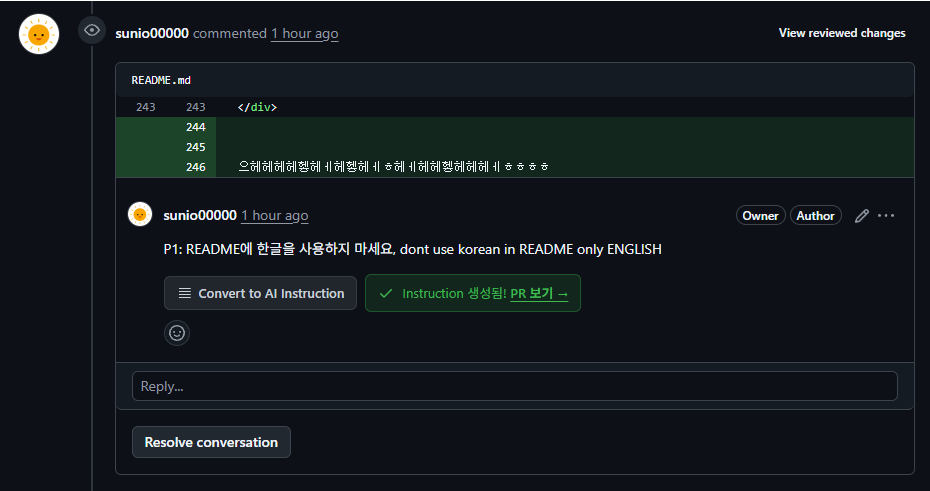
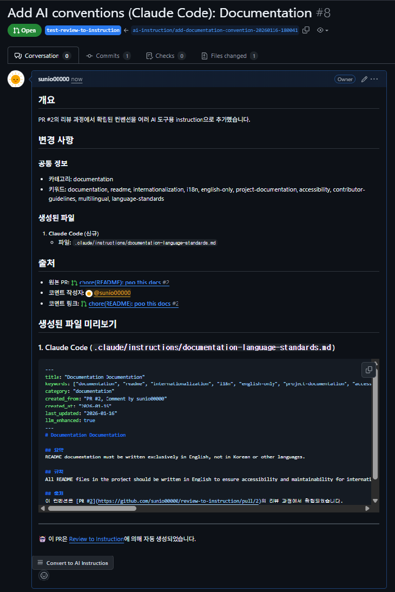
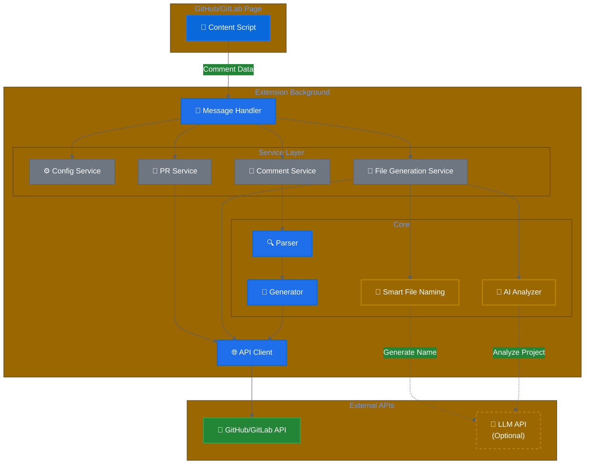

# Review to Instruction

<div align="center">

[](https://www.anthropic.com/claude)
[](./LICENSE)

**One-Click Conversion of PR Review Comments into AI-Ready Instructions**

Transform GitHub/GitLab review comments into structured instruction files for Claude Code, Cursor, and Windsurf

</div>

---

## 🎯 What It Does

Turns this PR comment:
```
Our team uses PascalCase for component file names.

✅ UserProfile.tsx
❌ userProfile.tsx
```

Into AI-ready instruction files automatically:
- `.claude/instructions/component-naming.md`
- `.cursorrules` (appends rule)
- `rules/component-naming.md`

**All in one PR with a single click.**

## 📸 Demo

<div align="center">

### Extension in Action

*Click "Convert to AI Instruction" button on any convention-related PR comment*

### Before & After

---

### ❌ **Without Extension** (Manual Process)

<div align="center">

When you see a convention comment during PR review, you need to:

💬 Discuss with team if this should be a convention<br/>
🤝 Get team consensus on the approach<br/>
📋 Copy the comment text manually<br/>
🤔 Think of an appropriate filename<br/>
🔍 Navigate to `.claude/instructions/` folder<br/>
📝 Create new `.md` file<br/>
⚙️ Write YAML frontmatter (title, keywords, category...)<br/>
✍️ Format content in Markdown<br/>
🌿 Create new branch<br/>
💾 Commit the file<br/>
🔀 Open Pull Request<br/>
📄 Write PR description<br/>
🔁 Repeat for `.cursorrules` (Cursor)<br/>
🔁 Repeat for `rules/` (Windsurf)

### ⏱️ **Time Required: 15-20 minutes per convention**

*Plus mental context switching and risk of inconsistent formatting*

</div>

---

### ✅ **With Extension** (One-Click Automation)

<div align="center">

🔥🔥 Simply **click "Convert to AI Instruction"** button 🔥🔥

✨ **Extension automatically handles everything:**

🤖 Analyzes comment with AI (Claude/OpenAI)<br/>
📝 Generates professional summaries and explanations<br/>
🎯 Extracts keywords and categorizes content<br/>
📁 Creates files for **ALL tools simultaneously:**<br/>
&nbsp;&nbsp;&nbsp;&nbsp;• `.claude/instructions/xxx.md` (Claude Code)<br/>
&nbsp;&nbsp;&nbsp;&nbsp;• `.cursorrules` (Cursor)<br/>
&nbsp;&nbsp;&nbsp;&nbsp;• `rules/xxx.md` (Windsurf)<br/>
🌿 Creates branch with unique timestamp<br/>
💾 Commits all files with detailed messages<br/>
🔀 Opens Pull Request with preview<br/>
🎯 Targets the correct branch automatically

### ⚡ **Time Required: 5 seconds**

### 🎉 **Save 90%+ of your time!**

*No context switching. No formatting errors. Consistent quality every time.*

<br/>

<table>
<tr>
<td width="50%"></td>
<td width="50%"></td>
</tr>
<tr>
<td align="center"><em>1. Click button on PR comment</em></td>
<td align="center"><em>2. Review generated PR</em></td>
</tr>
</table>

</div>

---

</div>

## 🏗️ How It Works


```mermaid
%%{init: {'theme':'base', 'themeVariables': { 'primaryColor':'#0969da','primaryTextColor':'#ffffff','primaryBorderColor':'#1f6feb','lineColor':'#57606a','secondaryColor':'#238636','tertiaryColor':'#9a6700','noteBkgColor':'#ffffff','noteTextColor':'#1f2328'}}}%%
graph LR
    A["💬 PR Comment"] -->|1. Detect| B["🔘 Extension Button"]
    B -->|2. Parse| C["🔍 Extract Keywords"]
    C -->|3. Match| D["📂 Find Existing Files"]
    D -->|4. Generate| E["📝 Create/Update Files"]
    E -->|5. Auto-Commit| F["✅ New PR Created"]

    style A fill:#0969da,stroke:#1f6feb,stroke-width:2px,color:#ffffff
    style B fill:#1f6feb,stroke:#0969da,stroke-width:2px,color:#ffffff
    style C fill:#1f6feb,stroke:#0969da,stroke-width:2px,color:#ffffff
    style D fill:#1f6feb,stroke:#0969da,stroke-width:2px,color:#ffffff
    style E fill:#1f6feb,stroke:#0969da,stroke-width:2px,color:#ffffff
    style F fill:#238636,stroke:#2da44e,stroke-width:2px,color:#ffffff
```

### Architecture


```mermaid
%%{init: {'theme':'base', 'themeVariables': { 'primaryColor':'#0969da','primaryTextColor':'#ffffff','primaryBorderColor':'#1f6feb','lineColor':'#57606a','secondaryColor':'#238636','tertiaryColor':'#9a6700'}}}%%
graph TB
    subgraph "GitHub/GitLab Page"
        A["📄 Content Script"]
    end

    subgraph "Extension Background"
        B["📨 Message Handler"]

        subgraph "Service Layer"
            C1["⚙️ Config Service"]
            C2["💬 Comment Service"]
            C3["📁 File Generation Service"]
            C4["🔀 PR Service"]
        end

        subgraph "Core"
            D["🔍 Parser"]
            E["📝 Generator"]
            F["🤖 AI Analyzer"]
            G["🎯 Smart File Naming"]
        end

        H["🌐 API Client"]
    end

    subgraph "External APIs"
        I["📡 GitHub/GitLab API"]
        J["🤖 LLM API<br/>(Optional)"]
    end

    A -->|Comment Data| B
    B --> C1 & C2 & C3 & C4
    C2 --> D
    C3 --> F & G
    F -.->|Analyze Project| J
    G -.->|Generate Name| J
    D --> E
    E --> H
    C3 & C4 --> H
    H --> I

    style A fill:#0969da,stroke:#1f6feb,stroke-width:2px,color:#ffffff
    style B fill:#1f6feb,stroke:#0969da,stroke-width:2px,color:#ffffff
    style C1 fill:#6e7781,stroke:#57606a,stroke-width:1px,color:#ffffff
    style C2 fill:#6e7781,stroke:#57606a,stroke-width:1px,color:#ffffff
    style C3 fill:#6e7781,stroke:#57606a,stroke-width:1px,color:#ffffff
    style C4 fill:#6e7781,stroke:#57606a,stroke-width:1px,color:#ffffff
    style D fill:#1f6feb,stroke:#0969da,stroke-width:2px,color:#ffffff
    style E fill:#1f6feb,stroke:#0969da,stroke-width:2px,color:#ffffff
    style F fill:#9a6700,stroke:#bf8700,stroke-width:2px,color:#ffffff
    style G fill:#9a6700,stroke:#bf8700,stroke-width:2px,color:#ffffff
    style H fill:#1f6feb,stroke:#0969da,stroke-width:2px,color:#ffffff
    style I fill:#238636,stroke:#2da44e,stroke-width:2px,color:#ffffff
    style J fill:#9a6700,stroke:#bf8700,stroke-width:2px,stroke-dasharray: 5 5,color:#ffffff
```

## 🚀 Quick Start

### 1. Install Extension

```bash
git clone https://github.com/sunio00000/review-to-instruction.git
cd review-to-instruction
npm install
npm run build
```

Load `dist/` folder in Chrome (`chrome://extensions` → Developer mode → Load unpacked)

### 2. Configure API Token

1. Click extension icon
2. Generate GitHub/GitLab token with `repo` scope
3. Paste token and click "Test Connection"
4. Save

### 3. Use in PR

1. Write convention comment with keywords (`convention`, `rule`, `pattern`)
2. Click **"Convert to AI Instruction"** button
3. Review generated PR
4. Merge

Done! Your AI agents now understand this convention.

## ✨ Key Features

### Core Features
- **Multi-Tool Support**: Auto-detects Claude Code, Cursor, Windsurf in your project
- **Smart Matching**: Updates existing files or creates new ones intelligently
- **LLM Enhancement** (Optional): Uses Claude/OpenAI for better summaries and explanations
- **Intelligent Caching**: Reduces LLM API costs by 50-70%
- **Dark Mode**: Adapts to GitHub/GitLab themes

### AI-Powered Intelligence (New! 🎉)
- **Project Analysis**: Automatically analyzes existing instruction files to learn your project's patterns
  - Detects file naming conventions (kebab-case, PascalCase, snake_case)
  - Identifies common keywords and categories
  - Learns directory structure patterns
- **Smart File Naming**: AI generates appropriate filenames based on project context
  - Follows existing naming conventions automatically
  - Prevents duplicate files intelligently
  - Provides reasoning for filename choices
- **Duplicate Detection**: Finds similar instructions to suggest updates instead of creating new files

## 🛠️ Tech Stack

**Frontend**: TypeScript · Vite · Chrome Extension (Manifest V3)
**Testing**: Playwright · MSW (Mock Service Worker) · Express
**APIs**: GitHub/GitLab REST API · Claude API · OpenAI API
**Patterns**: Service Layer · Dependency Injection · Factory Pattern

## 📋 Documentation

- **[TESTING.md](./TESTING.md)** - Testing guide and E2E scenarios
- **[ARCHITECTURE.md](./ARCHITECTURE.md)** - Service layer and design patterns
- **[Claude Code Plugin Format](https://docs.anthropic.com/claude/docs)** - Learn about `.claude/` structure

## ❓ FAQ

**Q: What keywords trigger detection?**
Comments with `convention`, `rule`, `pattern`, `should`, `must`, or code examples (```)

**Q: Does it support GitLab self-hosted?**
Not yet. Only `gitlab.com` currently supported.

**Q: Can I skip LLM analysis?**
Yes! LLM is completely optional. Extension works perfectly with rule-based parsing alone.

**Q: Which AI tools are supported?**
Claude Code (`.claude/`), Cursor (`.cursorrules`), Windsurf (`rules/`)

**Q: How does AI-based file naming work?**
When LLM is enabled, the extension analyzes your existing instruction files to learn naming patterns, then uses AI to generate filenames that match your project's style. It falls back to rule-based naming if AI is unavailable.

**Q: Will it create duplicate files?**
No! The extension detects similar existing files and suggests updates instead of creating duplicates.

**Q: Can I batch-process multiple comments?**
Not yet. Planned for v1.3.

## 📝 License

MIT License - See [LICENSE](./LICENSE) for details.

## 📧 Contact

Questions or suggestions? Open an issue on [GitHub](https://github.com/sunio00000/review-to-instruction/issues)

---

<div align="center">

Made with ❤️ and Claude Sonnet 4.5

⭐ **[Star this repo](https://github.com/sunio00000/review-to-instruction)** if it helped you!

</div>


으헤헤헤헤헿헤ㅔ헤헿헤ㅔㅎ헤ㅔ헤헤헿헤헤헤ㅔㅎㅎㅎㅎ