# Review to Instruction

<div align="center">

[](https://www.anthropic.com/claude)
[](./LICENSE)

**One-Click Conversion of PR Review Comments into AI-Ready Instructions**

Transform GitHub/GitLab review comments into structured instruction files for Claude Code, Cursor, and Windsurf

</div>

---

## 🎯 What It Does

Turns this PR comment:
```
Our team uses PascalCase for component file names.

✅ UserProfile.tsx
❌ userProfile.tsx
```

Into AI-ready instruction files automatically:
- `.claude/instructions/component-naming.md`
- `.cursorrules` (appends rule)
- `rules/component-naming.md`

**All in one PR with a single click.**

## 📸 Demo

<div align="center">

### Extension in Action

*Click "Convert to AI Instruction" button on any convention-related PR comment*

### Before & After
<table>
<tr>
<td width="50%">

**GitHub PR Comment**


</td>
<td width="50%">

**Generated PR**


</td>
</tr>
</table>

</div>

> **Note**: Screenshots will be added soon. To contribute demo materials, see [CONTRIBUTING.md](./CONTRIBUTING.md)

## 🏗️ How It Works


### Architecture

```mermaid
%%{init: {'theme':'base', 'themeVariables': { 'primaryColor':'#0969da','primaryTextColor':'#ffffff','primaryBorderColor':'#1f6feb','lineColor':'#57606a','secondaryColor':'#238636','tertiaryColor':'#9a6700'}}}%%
graph TB
    subgraph "GitHub/GitLab Page"
        A["📄 Content Script"]
    end

    subgraph "Extension Background"
        B["📨 Message Handler"]
        C["🌐 API Client"]
        D["🔍 Parser"]
        E["⚙️ File Generator"]
    end

    subgraph "External APIs"
        F["📡 GitHub/GitLab API"]
        G["🤖 LLM API<br/>(Optional)"]
    end

    A -->|Comment Data| B
    B --> D
    D -->|Keywords| E
    E --> C
    C --> F
    B -.->|Enhance| G
    C -->|Create PR| F

    style A fill:#0969da,stroke:#1f6feb,stroke-width:2px,color:#ffffff
    style B fill:#1f6feb,stroke:#0969da,stroke-width:2px,color:#ffffff
    style C fill:#1f6feb,stroke:#0969da,stroke-width:2px,color:#ffffff
    style D fill:#1f6feb,stroke:#0969da,stroke-width:2px,color:#ffffff
    style E fill:#1f6feb,stroke:#0969da,stroke-width:2px,color:#ffffff
    style F fill:#238636,stroke:#2da44e,stroke-width:2px,color:#ffffff
    style G fill:#9a6700,stroke:#bf8700,stroke-width:2px,stroke-dasharray: 5 5,color:#ffffff
```



## 🚀 Quick Start

### 1. Install Extension

```bash
git clone https://github.com/sunio00000/review-to-instruction.git
cd review-to-instruction
npm install
npm run build
```

Load `dist/` folder in Chrome (`chrome://extensions` → Developer mode → Load unpacked)

### 2. Configure API Token

1. Click extension icon
2. Generate GitHub/GitLab token with `repo` scope
3. Paste token and click "Test Connection"
4. Save

### 3. Use in PR

1. Write convention comment with keywords (`convention`, `rule`, `pattern`)
2. Click **"Convert to AI Instruction"** button
3. Review generated PR
4. Merge

Done! Your AI agents now understand this convention.

## ✨ Key Features

- **Multi-Tool Support**: Auto-detects Claude Code, Cursor, Windsurf in your project
- **Smart Matching**: Updates existing files or creates new ones intelligently
- **LLM Enhancement** (Optional): Uses Claude/OpenAI for better summaries and explanations
- **Intelligent Caching**: Reduces LLM API costs by 50-70%
- **Dark Mode**: Adapts to GitHub/GitLab themes

## 🛠️ Tech Stack

TypeScript · Vite · Chrome Extension (Manifest V3) · GitHub/GitLab REST API

## 📋 Documentation

- **[TESTING.md](./TESTING.md)** - Testing guide and scenarios
- **[Claude Code Plugin Format](https://docs.anthropic.com/claude/docs)** - Learn about `.claude/` structure

## ❓ FAQ

**Q: What keywords trigger detection?**
Comments with `convention`, `rule`, `pattern`, `should`, `must`, or code examples (```)

**Q: Does it support GitLab self-hosted?**
Not yet. Only `gitlab.com` currently supported.

**Q: Can I skip LLM analysis?**
Yes! LLM is completely optional. Extension works perfectly with rule-based parsing alone.

**Q: Which AI tools are supported?**
Claude Code (`.claude/`), Cursor (`.cursorrules`), Windsurf (`rules/`)

**Q: Can I batch-process multiple comments?**
Not yet. Planned for v1.3.

## 📝 License

MIT License - See [LICENSE](./LICENSE) for details.

## 📧 Contact

Questions or suggestions? Open an issue on [GitHub](https://github.com/sunio00000/review-to-instruction/issues)

---

<div align="center">

Made with ❤️ and Claude Sonnet 4.5

⭐ **[Star this repo](https://github.com/sunio00000/review-to-instruction)** if it helped you!

</div>
