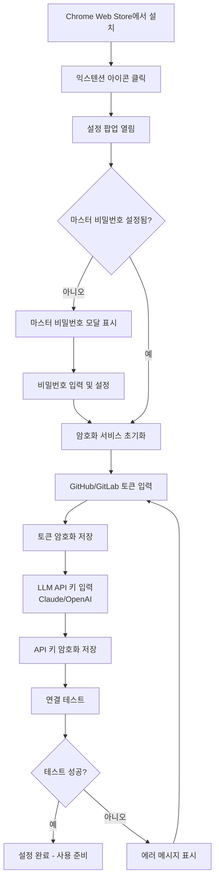
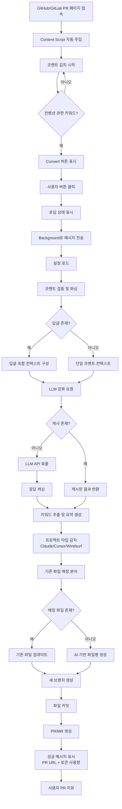
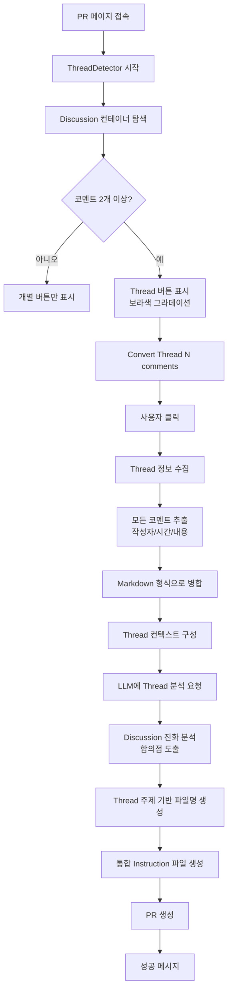
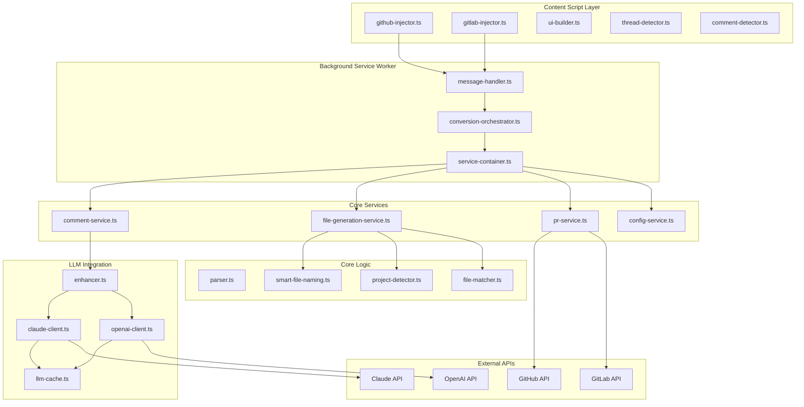
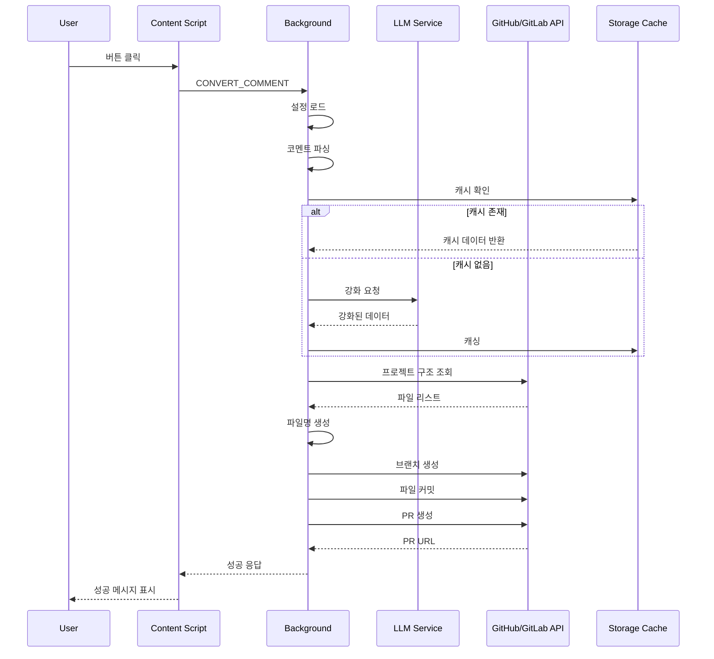
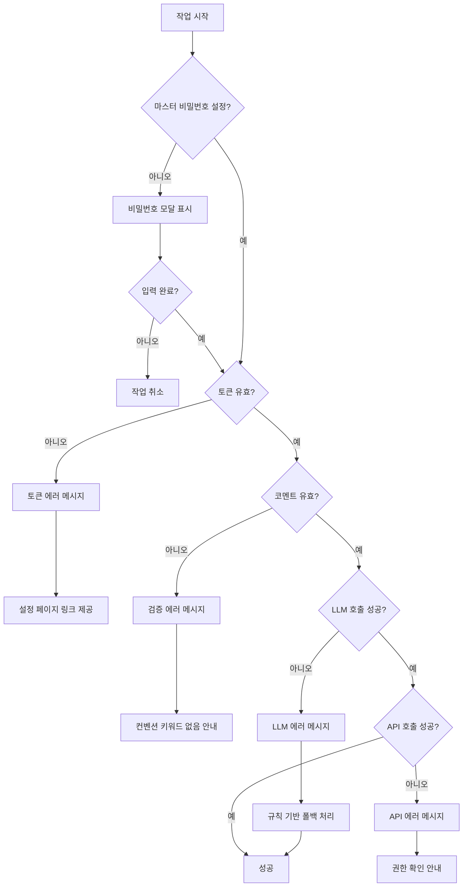

# User Flows

이 문서는 Review to Instruction 익스텐션의 주요 사용자 시나리오와 상세한 흐름을 설명합니다.

## 목차

1. [초기 설정 플로우](#1-초기-설정-플로우)
2. [개별 코멘트 변환 플로우](#2-개별-코멘트-변환-플로우)
3. [Discussion Thread 변환 플로우](#3-discussion-thread-변환-플로우)
4. [기술 아키텍처 플로우](#4-기술-아키텍처-플로우)

---

## 1. 초기 설정 플로우

### 사용자 시나리오
개발자가 처음으로 익스텐션을 설치하고 사용을 시작하는 과정

### 단계별 흐름



### 상세 설명

#### 1.1 익스텐션 설치
```
1. Chrome 브라우저에서 chrome://extensions 접속
2. "개발자 모드" 활성화
3. "압축해제된 확장 프로그램을 로드합니다" 클릭
4. dist/ 폴더 선택
5. 익스텐션 활성화 확인
```

#### 1.2 마스터 비밀번호 설정
- **목적**: API 토큰과 키를 안전하게 암호화
- **입력**: 8자 이상의 강력한 비밀번호
- **저장**: 메모리에만 저장 (재시작 시 재입력 필요)
- **보안**: AES-GCM 암호화 사용

#### 1.3 GitHub/GitLab 토큰 설정
**GitHub Personal Access Token**
- Scope: `repo` (전체 저장소 접근)
- 발급: https://github.com/settings/tokens/new?scopes=repo
- 저장: `githubToken` (암호화됨)

**GitLab Personal Access Token**
- Scope: `api` (API 접근)
- 발급: https://gitlab.com/-/profile/personal_access_tokens
- 저장: `gitlabToken` (암호화됨)
- GitLab URL: 자체 호스팅 인스턴스 지원

#### 1.4 LLM API 키 설정
**Claude API**
- Provider: Anthropic
- Model: Claude Sonnet 3.5+
- 저장: `claudeApiKey` (암호화됨)

**OpenAI API**
- Provider: OpenAI
- Model: GPT-4+
- 저장: `openaiApiKey` (암호화됨)

#### 1.5 연결 테스트
```javascript
// GitHub API 테스트
GET https://api.github.com/user
Authorization: token <githubToken>

// GitLab API 테스트
GET <gitlabUrl>/api/v4/user
PRIVATE-TOKEN: <gitlabToken>

// 성공 시 사용자 정보 표시
```

---

## 2. 개별 코멘트 변환 플로우

### 사용자 시나리오
PR 리뷰 중 컨벤션 관련 코멘트 하나를 AI instruction 파일로 변환

### 단계별 흐름



### 상세 설명

#### 2.1 코멘트 감지 (Content Script)

**감지 로직**
```javascript
// 컨벤션 관련 키워드 패턴
const CONVENTION_KEYWORDS = [
  'convention', 'rule', 'pattern', 'standard',
  'should use', 'must use', 'always', 'never',
  '컨벤션', '규칙', '패턴', '표준'
];

// 코멘트 내용 확인
function isConventionComment(content: string): boolean {
  const lowerContent = content.toLowerCase();
  return CONVENTION_KEYWORDS.some(keyword =>
    lowerContent.includes(keyword)
  );
}
```

**버튼 주입**
```html
<!-- 주입되는 버튼 -->
<button class="review-to-instruction-button">
  🤖 Convert to AI Instruction
</button>
```

#### 2.2 코멘트 파싱

**추출 정보**
- **키워드**: 정규식 + 키워드 사전 기반
- **카테고리**: conventions/patterns/style/architecture
- **코드 예제**: ```로 감싸진 블록
- **제안 파일명**: 코멘트 내 힌트 파싱

```javascript
// 파싱 결과 예시
{
  keywords: ['PascalCase', 'component', 'naming'],
  category: 'conventions',
  codeExamples: [
    { before: 'userProfile.tsx', after: 'UserProfile.tsx' }
  ],
  suggestedFileName: 'component-naming'
}
```

#### 2.3 LLM 강화

**프롬프트 구조**
```
You are analyzing a code review comment about conventions.

Comment:
${commentContent}

${repliesContext ? `Replies:\n${repliesContext}` : ''}

Task:
1. Generate a concise summary (1-2 sentences)
2. Provide detailed explanation
3. Extract additional keywords
4. Suggest appropriate category
5. Explain code examples

Output JSON format:
{
  "summary": "...",
  "detailedExplanation": "...",
  "additionalKeywords": [...],
  "suggestedCategory": "...",
  "codeExplanations": [...]
}
```

**캐싱 전략**
```javascript
// 캐시 키 생성
const cacheKey = hashContent(commentContent + repliesContext);

// 캐시 조회 (chrome.storage.local)
const cached = await cache.get(cacheKey);
if (cached && !isExpired(cached.timestamp)) {
  return cached.data;
}

// LLM 호출 및 캐싱
const result = await llm.analyze(prompt);
await cache.set(cacheKey, result, TTL_24_HOURS);
```

#### 2.4 프로젝트 타입 감지

**감지 순서**
1. `.claude/` 디렉토리 존재 → Claude Code
2. `.cursor/rules/` 디렉토리 존재 → Cursor
3. `.windsurf/` 디렉토리 존재 → Windsurf

**파일 생성 경로**
```javascript
const projectTypePaths = {
  'claude-code': {
    instructions: '.claude/instructions/',
    skills: '.claude/skills/',
    rules: '.claude/rules/'
  },
  'cursor': {
    rules: '.cursor/rules/'  // 다중 파일
  },
  'windsurf': {
    rules: '.windsurf/rules/'
  }
};
```

#### 2.5 파일명 생성

**AI 기반 네이밍**
```
Analyze this convention to generate a filename:

Project Pattern: kebab-case
Existing Files: api-error-handling.md, async-patterns.md
Keywords: ${keywords}
Category: ${category}
Summary: ${summary}

Generate:
{
  "filename": "component-naming.md",
  "directory": ".claude/rules",
  "reasoning": "..."
}
```

#### 2.6 PR 생성

**PR 타이틀 (LLM 생성)**
```
feat(conventions): add component naming guidelines
```

**PR 본문**
```markdown
## Added Convention

**Category**: Conventions
**Keywords**: PascalCase, component, naming

### Summary
Use PascalCase for all React component file names.

### Details
[LLM generated detailed explanation]

### Code Examples
✅ `UserProfile.tsx`
❌ `userProfile.tsx`

---
🤖 Generated by Review to Instruction
Token Usage: 1,234 input / 567 output
```

---

## 3. Discussion Thread 변환 플로우

### 사용자 시나리오
여러 코멘트로 구성된 Discussion Thread 전체를 하나의 통합 instruction으로 변환

### 단계별 흐름



### 상세 설명

#### 3.1 Thread 감지

**DOM 선택자 (GitHub)**
```javascript
const GITHUB_THREAD_SELECTORS = {
  container: [
    '.timeline-comment-group',  // 일반 코멘트 그룹
    '.review-thread',           // 리뷰 스레드
    '[data-discussion-id]'      // Discussion ID
  ],
  comment: '.timeline-comment, .review-comment',
  content: '.comment-body',
  author: '.author',
  time: 'relative-time'
};
```

**DOM 선택자 (GitLab)**
```javascript
const GITLAB_THREAD_SELECTORS = {
  container: [
    '.discussion-notes',
    '.notes',
    '[data-discussion-id]'
  ],
  comment: '.note:not(.system-note)',
  content: '.note-text',
  author: '.note-header-author-name',
  time: 'time'
};
```

#### 3.2 Thread 코멘트 병합

**병합 형식**
```markdown
### Comment 1 by @Alice (2025-01-27 10:30)

We should use PascalCase for components.

✅ UserProfile.tsx
❌ userProfile.tsx

---

### Comment 2 by @Bob (2025-01-27 11:15)

Good idea! What about utility components?

---

### Comment 3 by @Charlie (2025-01-27 14:20)

For utilities, let's use lowercase with "use" prefix:
- useAuth.ts
- useFetch.ts

---

### Comment 4 by @Alice (2025-01-27 15:00)

Perfect! Let's document this as our standard.
```

#### 3.3 Thread 전용 LLM 프롬프트

```
# Discussion Thread Analysis

This is a Discussion Thread with 4 comments from: Alice, Bob, Charlie

## Thread Context

### Comment 1 by @Alice
We should use PascalCase for components...

### Comment 2 by @Bob
Good idea! What about utility components?...

### Comment 3 by @Charlie
For utilities, let's use lowercase...

### Comment 4 by @Alice
Perfect! Let's document this...

## Task

Analyze this entire Discussion Thread about coding conventions.

Focus on:
1. **Main Convention/Pattern**: What is the central topic?
2. **Evolution of Ideas**: How did the discussion develop?
3. **Consensus**: What is the final agreement?
4. **Actionable Guidelines**: What specific rules emerged?

Create a unified instruction capturing the essence of this discussion.

Output JSON:
{
  "summary": "Team consensus on component naming conventions",
  "detailedExplanation": "...",
  "keywords": ["PascalCase", "component", "utility", "hooks"],
  "category": "conventions",
  "consensus": "PascalCase for components, lowercase+use for hooks"
}
```

#### 3.4 Thread 파일명 생성

**Thread 전용 네이밍 프롬프트**
```
Analyze this Discussion Thread to generate a filename.

Thread Overview:
- Total comments: 4
- Participants: Alice, Bob, Charlie
- Platform: GitHub

Discussion Summary:
Component naming evolved from simple PascalCase rule to
comprehensive standard including utilities and hooks.

Existing Files: api-conventions.md, testing-patterns.md

Generate filename reflecting the thread's central topic:
Consider:
1. Main topic discussed
2. Whether it's new or refining existing
3. Use prefixes like "discussion-", "consensus-", "refine-"

Output:
{
  "filename": "component-naming-consensus.md",
  "directory": ".claude/rules",
  "reasoning": "Thread reached consensus on component and hook naming"
}
```

#### 3.5 통합 Instruction 생성

**최종 파일 구조**
```markdown
# Component Naming Consensus

**Thread Discussion**: 4 comments by Alice, Bob, Charlie
**Date**: 2025-01-27
**Category**: Conventions
**Keywords**: PascalCase, component, utility, hooks

## Summary

Team consensus on naming conventions for React components and hooks.

## Discussion Evolution

1. **Initial Proposal** (Alice): PascalCase for all components
2. **Question Raised** (Bob): What about utilities?
3. **Solution Proposed** (Charlie): Lowercase with "use" prefix for hooks
4. **Agreement Reached** (Alice): Documented as standard

## Final Guidelines

### React Components
✅ Use PascalCase for component files
- `UserProfile.tsx`
- `Button.tsx`
- `NavBar.tsx`

❌ Avoid lowercase
- `userProfile.tsx`
- `button.tsx`

### Custom Hooks
✅ Use lowercase with "use" prefix
- `useAuth.ts`
- `useFetch.ts`
- `useLocalStorage.ts`

### Utility Functions
✅ Use lowercase
- `formatDate.ts`
- `parseUrl.ts`

## Code Examples

[Combined examples from all comments]

---

## Original Discussion

### Comment 1 by @Alice (2025-01-27 10:30)
[Original content]

### Comment 2 by @Bob (2025-01-27 11:15)
[Original content]

### Comment 3 by @Charlie (2025-01-27 14:20)
[Original content]

### Comment 4 by @Alice (2025-01-27 15:00)
[Original content]
```

---

## 4. 기술 아키텍처 플로우

### 전체 시스템 구조



### 메시지 플로우

**개별 코멘트 변환**
```javascript
// 1. Content Script → Background
{
  type: 'CONVERT_COMMENT',
  payload: {
    comment: {
      id: 'comment-123',
      author: 'Alice',
      content: '...',
      replies: [...]
    },
    repository: {
      owner: 'acme',
      name: 'project',
      branch: 'main',
      platform: 'github'
    }
  }
}

// 2. Background 처리
ConversionOrchestrator.convertComment()
  → CommentService.validateAndEnhance()
  → LLM.enhanceWithLLM()
  → FileGenerationService.generateForAllTypes()
  → PRService.create()

// 3. Background → Content Script
{
  success: true,
  data: {
    prUrl: 'https://github.com/acme/project/pull/456',
    files: [
      { projectType: 'claude-code', filePath: '.claude/rules/...' }
    ],
    category: 'conventions',
    keywords: ['PascalCase', 'component'],
    tokenUsage: { inputTokens: 1234, outputTokens: 567 }
  }
}
```

**Thread 변환**
```javascript
// 1. Content Script → Background
{
  type: 'CONVERT_THREAD',
  payload: {
    thread: {
      id: 'thread-456',
      platform: 'github',
      comments: [
        { id: '1', author: 'Alice', content: '...', createdAt: '...' },
        { id: '2', author: 'Bob', content: '...', createdAt: '...' },
        { id: '3', author: 'Charlie', content: '...', createdAt: '...' }
      ]
    },
    repository: { ... }
  }
}

// 2. Background 처리
ConversionOrchestrator.convertThread()
  → mergeThreadComments()  // Markdown 병합
  → CommentService.validateAndEnhanceThread()
  → LLM.enhanceWithLLM(thread context)
  → FileGenerationService.generateForAllTypes(thread)
  → PRService.create()

// 3. Response (동일 구조)
```

### 데이터 흐름



### 상태 관리

**Storage 구조**
```javascript
// chrome.storage.local
{
  // 설정 (암호화됨)
  'githubToken_enc': 'encrypted_data...',
  'gitlabToken_enc': 'encrypted_data...',
  'claudeApiKey_enc': 'encrypted_data...',
  'openaiApiKey_enc': 'encrypted_data...',

  // LLM 설정
  'llm': {
    provider: 'claude',  // or 'openai'
    enableCache: true
  },

  // UI 설정
  'showButtons': {
    github: true,
    gitlab: true
  },

  // LLM 캐시 (TTL: 24시간)
  'llm_cache_<hash>': {
    data: { ... },
    timestamp: 1706345678901,
    ttl: 86400000
  }
}

// chrome.storage.session (메모리)
{
  'master_password': 'user_entered_password'  // 세션 종료 시 삭제
}
```

### 에러 처리 플로우



---

## 5. 성능 최적화

### 캐싱 전략

**LLM 응답 캐싱**
- 키: SHA-256(코멘트 내용 + 답글 내용)
- TTL: 24시간
- 저장소: chrome.storage.local
- 예상 절감: 50-70% API 비용

**프로젝트 분석 캐싱**
- 키: `${owner}/${repo}/${branch}`
- TTL: 1시간
- 내용: 파일 리스트, 네이밍 패턴, 디렉토리 구조

### 병렬 처리

**멀티 프로젝트 타입 생성**
```javascript
// 순차 (기존)
for (const type of ['claude-code', 'cursor', 'windsurf']) {
  await generateFile(type);
}
// 시간: 3 x 평균 응답시간

// 병렬 (최적화)
await Promise.all([
  generateFile('claude-code'),
  generateFile('cursor'),
  generateFile('windsurf')
]);
// 시간: max(응답시간)
```

### 지연 로딩

**버튼 주입 최적화**
```javascript
// MutationObserver로 동적 코멘트 감지
const observer = new MutationObserver(mutations => {
  // Debounce: 100ms
  debouncedDetectComments();
});

// 이미 처리된 코멘트 추적 (WeakSet)
const processedComments = new WeakSet<HTMLElement>();
```

---

## 6. 보안 고려사항

### 토큰 보안

**암호화**
```javascript
// AES-GCM 암호화
const encrypt = async (plaintext: string, password: string) => {
  const salt = crypto.getRandomValues(new Uint8Array(16));
  const key = await deriveKey(password, salt);
  const iv = crypto.getRandomValues(new Uint8Array(12));
  const encrypted = await crypto.subtle.encrypt(
    { name: 'AES-GCM', iv },
    key,
    encoder.encode(plaintext)
  );
  return { encrypted, salt, iv };
};
```

**권한 최소화**
```json
{
  "permissions": [
    "storage",      // 설정 저장만
    "activeTab"     // 현재 탭만
  ],
  "host_permissions": [
    "https://github.com/*",
    "https://gitlab.com/*"
  ]
}
```

### API 키 관리

**저장 위치**
- ❌ `chrome.storage.sync` - 클라우드 동기화 보안 위험
- ✅ `chrome.storage.local` - 로컬 암호화 저장
- ✅ `chrome.storage.session` - 메모리 임시 저장 (마스터 비밀번호)

**접근 제어**
- Content Script: API 키 접근 불가
- Background Service Worker: 암호화된 키만 복호화 가능
- Popup: 마스터 비밀번호 입력 후 접근

---

## 부록: 주요 파일 역할

| 파일 | 역할 |
|------|------|
| `src/content/main.ts` | Content Script 엔트리포인트 |
| `src/content/github-injector.ts` | GitHub 버튼 주입 및 Thread 감지 |
| `src/content/gitlab-injector.ts` | GitLab 버튼 주입 및 Thread 감지 |
| `src/content/thread-detector.ts` | Discussion Thread 감지 클래스 |
| `src/content/ui-builder.ts` | 버튼 UI 생성 및 관리 |
| `src/background/service-worker.ts` | Background 엔트리포인트 |
| `src/background/message-handler.ts` | 메시지 라우팅 |
| `src/background/services/conversion-orchestrator.ts` | 변환 로직 조율 |
| `src/background/services/comment-service.ts` | 코멘트 검증 및 강화 |
| `src/background/services/file-generation-service.ts` | 파일 생성 서비스 |
| `src/background/services/pr-service.ts` | PR/MR 생성 서비스 |
| `src/background/llm/enhancer.ts` | LLM 강화 엔트리포인트 |
| `src/background/llm/claude-client.ts` | Claude API 클라이언트 |
| `src/background/llm/openai-client.ts` | OpenAI API 클라이언트 |
| `src/background/llm/cache.ts` | LLM 응답 캐싱 |
| `src/core/parser.ts` | 코멘트 파싱 로직 |
| `src/core/smart-file-naming.ts` | AI 기반 파일명 생성 |
| `src/core/project-detector.ts` | 프로젝트 타입 감지 |
| `src/core/file-matcher.ts` | 기존 파일 매칭 |
| `src/popup/popup.ts` | 설정 팝업 로직 |
| `src/utils/crypto-service.ts` | 암호화 서비스 |

---

**문서 버전**: 1.3.0
**최종 업데이트**: 2025-01-27
