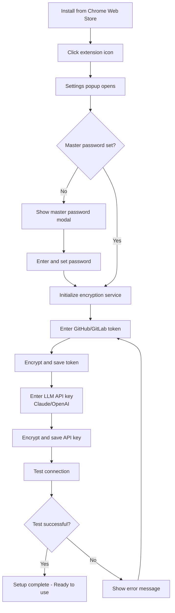
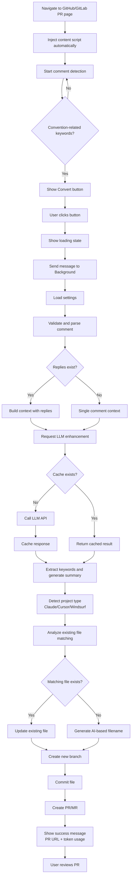
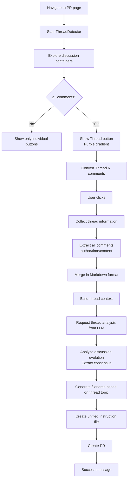
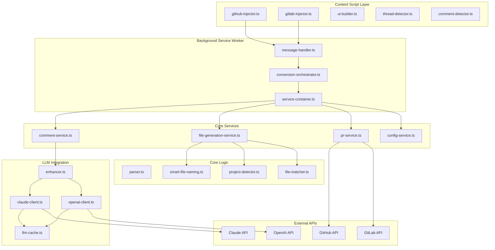
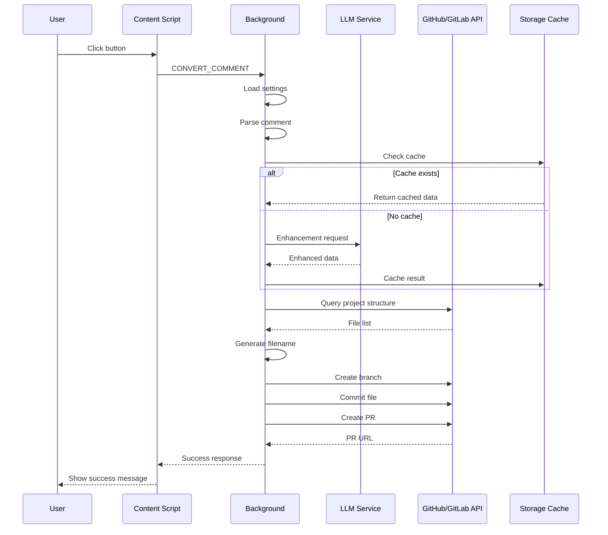
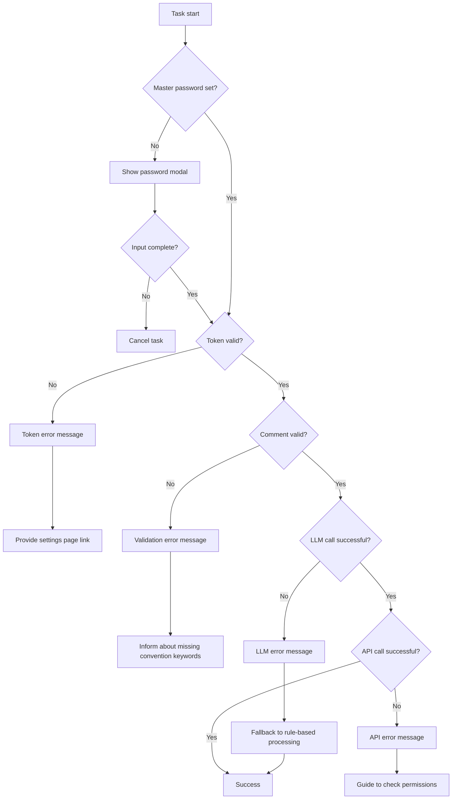

# User Flows

This document describes the main user scenarios and detailed flows of the Review to Instruction extension.

## Table of Contents

1. [Initial Setup Flow](#1-initial-setup-flow)
2. [Individual Comment Conversion Flow](#2-individual-comment-conversion-flow)
3. [Discussion Thread Conversion Flow](#3-discussion-thread-conversion-flow)
4. [Technical Architecture Flow](#4-technical-architecture-flow)

---

## 1. Initial Setup Flow

### User Scenario
Developer installs the extension for the first time and starts using it

### Step-by-Step Flow



### Detailed Description

#### 1.1 Extension Installation
```
1. Navigate to chrome://extensions in Chrome browser
2. Enable "Developer mode"
3. Click "Load unpacked"
4. Select dist/ folder
5. Verify extension is activated
```

#### 1.2 Master Password Setup
- **Purpose**: Securely encrypt API tokens and keys
- **Input**: Strong password of 8+ characters
- **Storage**: Stored in memory only (re-entry required after restart)
- **Security**: Uses AES-GCM encryption

#### 1.3 GitHub/GitLab Token Configuration
**GitHub Personal Access Token**
- Scope: `repo` (full repository access)
- Generate at: https://github.com/settings/tokens/new?scopes=repo
- Stored as: `githubToken` (encrypted)

**GitLab Personal Access Token**
- Scope: `api` (API access)
- Generate at: https://gitlab.com/-/profile/personal_access_tokens
- Stored as: `gitlabToken` (encrypted)
- GitLab URL: Supports self-hosted instances

#### 1.4 LLM API Key Configuration
**Claude API**
- Provider: Anthropic
- Model: Claude Sonnet 3.5+
- Stored as: `claudeApiKey` (encrypted)

**OpenAI API**
- Provider: OpenAI
- Model: GPT-4+
- Stored as: `openaiApiKey` (encrypted)

#### 1.5 Connection Test
```javascript
// GitHub API test
GET https://api.github.com/user
Authorization: token <githubToken>

// GitLab API test
GET <gitlabUrl>/api/v4/user
PRIVATE-TOKEN: <gitlabToken>

// Display user information on success
```

---

## 2. Individual Comment Conversion Flow

### User Scenario
Convert a single convention-related comment from PR review into an AI instruction file

### Step-by-Step Flow



### Detailed Description

#### 2.1 Comment Detection (Content Script)

**Detection Logic**
```javascript
// Convention-related keyword patterns
const CONVENTION_KEYWORDS = [
  'convention', 'rule', 'pattern', 'standard',
  'should use', 'must use', 'always', 'never',
  '컨벤션', '규칙', '패턴', '표준'
];

// Check comment content
function isConventionComment(content: string): boolean {
  const lowerContent = content.toLowerCase();
  return CONVENTION_KEYWORDS.some(keyword =>
    lowerContent.includes(keyword)
  );
}
```

**Button Injection**
```html
<!-- Injected button -->
<button class="review-to-instruction-button">
  🤖 Convert to AI Instruction
</button>
```

#### 2.2 Comment Parsing

**Extracted Information**
- **Keywords**: Based on regex + keyword dictionary
- **Category**: conventions/patterns/style/architecture
- **Code Examples**: Blocks wrapped in ```
- **Suggested Filename**: Parse hints from comment

```javascript
// Parsing result example
{
  keywords: ['PascalCase', 'component', 'naming'],
  category: 'conventions',
  codeExamples: [
    { before: 'userProfile.tsx', after: 'UserProfile.tsx' }
  ],
  suggestedFileName: 'component-naming'
}
```

#### 2.3 LLM Enhancement

**Prompt Structure**
```
You are analyzing a code review comment about conventions.

Comment:
${commentContent}

${repliesContext ? `Replies:\n${repliesContext}` : ''}

Task:
1. Generate a concise summary (1-2 sentences)
2. Provide detailed explanation
3. Extract additional keywords
4. Suggest appropriate category
5. Explain code examples

Output JSON format:
{
  "summary": "...",
  "detailedExplanation": "...",
  "additionalKeywords": [...],
  "suggestedCategory": "...",
  "codeExplanations": [...]
}
```

**Caching Strategy**
```javascript
// Generate cache key
const cacheKey = hashContent(commentContent + repliesContext);

// Query cache (chrome.storage.local)
const cached = await cache.get(cacheKey);
if (cached && !isExpired(cached.timestamp)) {
  return cached.data;
}

// Call LLM and cache result
const result = await llm.analyze(prompt);
await cache.set(cacheKey, result, TTL_24_HOURS);
```

#### 2.4 Project Type Detection

**Detection Order**
1. `.claude/` directory exists → Claude Code
2. `.cursor/rules/` directory exists → Cursor
3. `.windsurf/` directory exists → Windsurf

**File Generation Paths**
```javascript
const projectTypePaths = {
  'claude-code': {
    instructions: '.claude/rules/',
    skills: '.claude/skills/',
    rules: '.claude/rules/'
  },
  'cursor': {
    rules: '.cursor/rules/'  // Multiple files
  },
  'windsurf': {
    rules: '.windsurf/rules/'
  }
};
```

#### 2.5 Filename Generation

**AI-based Naming**
```
Analyze this convention to generate a filename:

Project Pattern: kebab-case
Existing Files: api-error-handling.md, async-patterns.md
Keywords: ${keywords}
Category: ${category}
Summary: ${summary}

Generate:
{
  "filename": "component-naming.md",
  "directory": ".claude/rules",
  "reasoning": "..."
}
```

#### 2.6 PR Creation

**PR Title (LLM Generated)**
```
feat(conventions): add component naming guidelines
```

**PR Body**
```markdown
## Added Convention

**Category**: Conventions
**Keywords**: PascalCase, component, naming

### Summary
Use PascalCase for all React component file names.

### Details
[LLM generated detailed explanation]

### Code Examples
✅ `UserProfile.tsx`
❌ `userProfile.tsx`

---
🤖 Generated by Review to Instruction
Token Usage: 1,234 input / 567 output
```

---

## 3. Discussion Thread Conversion Flow

### User Scenario
Convert an entire Discussion Thread consisting of multiple comments into a unified instruction

### Step-by-Step Flow



### Detailed Description

#### 3.1 Thread Detection

**DOM Selectors (GitHub)**
```javascript
const GITHUB_THREAD_SELECTORS = {
  container: [
    '.timeline-comment-group',  // General comment group
    '.review-thread',           // Review thread
    '[data-discussion-id]'      // Discussion ID
  ],
  comment: '.timeline-comment, .review-comment',
  content: '.comment-body',
  author: '.author',
  time: 'relative-time'
};
```

**DOM Selectors (GitLab)**
```javascript
const GITLAB_THREAD_SELECTORS = {
  container: [
    '.discussion-notes',
    '.notes',
    '[data-discussion-id]'
  ],
  comment: '.note:not(.system-note)',
  content: '.note-text',
  author: '.note-header-author-name',
  time: 'time'
};
```

#### 3.2 Thread Comment Merging

**Merge Format**
```markdown
### Comment 1 by @Alice (2025-01-27 10:30)

We should use PascalCase for components.

✅ UserProfile.tsx
❌ userProfile.tsx

---

### Comment 2 by @Bob (2025-01-27 11:15)

Good idea! What about utility components?

---

### Comment 3 by @Charlie (2025-01-27 14:20)

For utilities, let's use lowercase with "use" prefix:
- useAuth.ts
- useFetch.ts

---

### Comment 4 by @Alice (2025-01-27 15:00)

Perfect! Let's document this as our standard.
```

#### 3.3 Thread-specific LLM Prompt

```
# Discussion Thread Analysis

This is a Discussion Thread with 4 comments from: Alice, Bob, Charlie

## Thread Context

### Comment 1 by @Alice
We should use PascalCase for components...

### Comment 2 by @Bob
Good idea! What about utility components?...

### Comment 3 by @Charlie
For utilities, let's use lowercase...

### Comment 4 by @Alice
Perfect! Let's document this...

## Task

Analyze this entire Discussion Thread about coding conventions.

Focus on:
1. **Main Convention/Pattern**: What is the central topic?
2. **Evolution of Ideas**: How did the discussion develop?
3. **Consensus**: What is the final agreement?
4. **Actionable Guidelines**: What specific rules emerged?

Create a unified instruction capturing the essence of this discussion.

Output JSON:
{
  "summary": "Team consensus on component naming conventions",
  "detailedExplanation": "...",
  "keywords": ["PascalCase", "component", "utility", "hooks"],
  "category": "conventions",
  "consensus": "PascalCase for components, lowercase+use for hooks"
}
```

#### 3.4 Thread Filename Generation

**Thread-specific Naming Prompt**
```
Analyze this Discussion Thread to generate a filename.

Thread Overview:
- Total comments: 4
- Participants: Alice, Bob, Charlie
- Platform: GitHub

Discussion Summary:
Component naming evolved from simple PascalCase rule to
comprehensive standard including utilities and hooks.

Existing Files: api-conventions.md, testing-patterns.md

Generate filename reflecting the thread's central topic:
Consider:
1. Main topic discussed
2. Whether it's new or refining existing
3. Use prefixes like "discussion-", "consensus-", "refine-"

Output:
{
  "filename": "component-naming-consensus.md",
  "directory": ".claude/rules",
  "reasoning": "Thread reached consensus on component and hook naming"
}
```

#### 3.5 Unified Instruction Generation

**Final File Structure**
```markdown
# Component Naming Consensus

**Thread Discussion**: 4 comments by Alice, Bob, Charlie
**Date**: 2025-01-27
**Category**: Conventions
**Keywords**: PascalCase, component, utility, hooks

## Summary

Team consensus on naming conventions for React components and hooks.

## Discussion Evolution

1. **Initial Proposal** (Alice): PascalCase for all components
2. **Question Raised** (Bob): What about utilities?
3. **Solution Proposed** (Charlie): Lowercase with "use" prefix for hooks
4. **Agreement Reached** (Alice): Documented as standard

## Final Guidelines

### React Components
✅ Use PascalCase for component files
- `UserProfile.tsx`
- `Button.tsx`
- `NavBar.tsx`

❌ Avoid lowercase
- `userProfile.tsx`
- `button.tsx`

### Custom Hooks
✅ Use lowercase with "use" prefix
- `useAuth.ts`
- `useFetch.ts`
- `useLocalStorage.ts`

### Utility Functions
✅ Use lowercase
- `formatDate.ts`
- `parseUrl.ts`

## Code Examples

[Combined examples from all comments]

---

## Original Discussion

### Comment 1 by @Alice (2025-01-27 10:30)
[Original content]

### Comment 2 by @Bob (2025-01-27 11:15)
[Original content]

### Comment 3 by @Charlie (2025-01-27 14:20)
[Original content]

### Comment 4 by @Alice (2025-01-27 15:00)
[Original content]
```

---

## 4. Technical Architecture Flow

### Overall System Structure



### Message Flow

**Individual Comment Conversion**
```javascript
// 1. Content Script → Background
{
  type: 'CONVERT_COMMENT',
  payload: {
    comment: {
      id: 'comment-123',
      author: 'Alice',
      content: '...',
      replies: [...]
    },
    repository: {
      owner: 'acme',
      name: 'project',
      branch: 'main',
      platform: 'github'
    }
  }
}

// 2. Background Processing
ConversionOrchestrator.convertComment()
  → CommentService.validateAndEnhance()
  → LLM.enhanceWithLLM()
  → FileGenerationService.generateForAllTypes()
  → PRService.create()

// 3. Background → Content Script
{
  success: true,
  data: {
    prUrl: 'https://github.com/acme/project/pull/456',
    files: [
      { projectType: 'claude-code', filePath: '.claude/rules/...' }
    ],
    category: 'conventions',
    keywords: ['PascalCase', 'component'],
    tokenUsage: { inputTokens: 1234, outputTokens: 567 }
  }
}
```

**Thread Conversion**
```javascript
// 1. Content Script → Background
{
  type: 'CONVERT_THREAD',
  payload: {
    thread: {
      id: 'thread-456',
      platform: 'github',
      comments: [
        { id: '1', author: 'Alice', content: '...', createdAt: '...' },
        { id: '2', author: 'Bob', content: '...', createdAt: '...' },
        { id: '3', author: 'Charlie', content: '...', createdAt: '...' }
      ]
    },
    repository: { ... }
  }
}

// 2. Background Processing
ConversionOrchestrator.convertThread()
  → mergeThreadComments()  // Markdown merge
  → CommentService.validateAndEnhanceThread()
  → LLM.enhanceWithLLM(thread context)
  → FileGenerationService.generateForAllTypes(thread)
  → PRService.create()

// 3. Response (same structure)
```

### Data Flow



### State Management

**Storage Structure**
```javascript
// chrome.storage.local
{
  // Settings (encrypted)
  'githubToken_enc': 'encrypted_data...',
  'gitlabToken_enc': 'encrypted_data...',
  'claudeApiKey_enc': 'encrypted_data...',
  'openaiApiKey_enc': 'encrypted_data...',

  // LLM settings
  'llm': {
    provider: 'claude',  // or 'openai'
    enableCache: true
  },

  // UI settings
  'showButtons': {
    github: true,
    gitlab: true
  },

  // LLM cache (TTL: 24 hours)
  'llm_cache_<hash>': {
    data: { ... },
    timestamp: 1706345678901,
    ttl: 86400000
  }
}

// chrome.storage.session (memory)
{
  'master_password': 'user_entered_password'  // Deleted on session end
}
```

### Error Handling Flow



---

## 5. Performance Optimization

### Caching Strategy

**LLM Response Caching**
- Key: SHA-256(comment content + replies content)
- TTL: 24 hours
- Storage: chrome.storage.local
- Expected savings: 50-70% API costs

**Project Analysis Caching**
- Key: `${owner}/${repo}/${branch}`
- TTL: 1 hour
- Content: File list, naming patterns, directory structure

### Parallel Processing

**Multi-Project Type Generation**
```javascript
// Sequential (old)
for (const type of ['claude-code', 'cursor', 'windsurf']) {
  await generateFile(type);
}
// Time: 3 x average response time

// Parallel (optimized)
await Promise.all([
  generateFile('claude-code'),
  generateFile('cursor'),
  generateFile('windsurf')
]);
// Time: max(response time)
```

### Lazy Loading

**Button Injection Optimization**
```javascript
// Detect dynamic comments with MutationObserver
const observer = new MutationObserver(mutations => {
  // Debounce: 100ms
  debouncedDetectComments();
});

// Track processed comments (WeakSet)
const processedComments = new WeakSet<HTMLElement>();
```

---

## 6. Security Considerations

### Token Security

**Encryption**
```javascript
// AES-GCM encryption
const encrypt = async (plaintext: string, password: string) => {
  const salt = crypto.getRandomValues(new Uint8Array(16));
  const key = await deriveKey(password, salt);
  const iv = crypto.getRandomValues(new Uint8Array(12));
  const encrypted = await crypto.subtle.encrypt(
    { name: 'AES-GCM', iv },
    key,
    encoder.encode(plaintext)
  );
  return { encrypted, salt, iv };
};
```

**Permission Minimization**
```json
{
  "permissions": [
    "storage",      // Settings storage only
    "activeTab"     // Current tab only
  ],
  "host_permissions": [
    "https://github.com/*",
    "https://gitlab.com/*"
  ]
}
```

### API Key Management

**Storage Location**
- ❌ `chrome.storage.sync` - Cloud sync security risk
- ✅ `chrome.storage.local` - Local encrypted storage
- ✅ `chrome.storage.session` - Memory temporary storage (master password)

**Access Control**
- Content Script: No API key access
- Background Service Worker: Can decrypt encrypted keys only
- Popup: Access after master password entry

---

## Appendix: Key File Roles

| File | Role |
|------|------|
| `src/content/main.ts` | Content Script entry point |
| `src/content/github-injector.ts` | GitHub button injection and Thread detection |
| `src/content/gitlab-injector.ts` | GitLab button injection and Thread detection |
| `src/content/thread-detector.ts` | Discussion Thread detection class |
| `src/content/ui-builder.ts` | Button UI creation and management |
| `src/background/service-worker.ts` | Background entry point |
| `src/background/message-handler.ts` | Message routing |
| `src/background/services/conversion-orchestrator.ts` | Conversion logic orchestration |
| `src/background/services/comment-service.ts` | Comment validation and enhancement |
| `src/background/services/file-generation-service.ts` | File generation service |
| `src/background/services/pr-service.ts` | PR/MR creation service |
| `src/background/llm/enhancer.ts` | LLM enhancement entry point |
| `src/background/llm/claude-client.ts` | Claude API client |
| `src/background/llm/openai-client.ts` | OpenAI API client |
| `src/background/llm/cache.ts` | LLM response caching |
| `src/core/parser.ts` | Comment parsing logic |
| `src/core/smart-file-naming.ts` | AI-based filename generation |
| `src/core/project-detector.ts` | Project type detection |
| `src/core/file-matcher.ts` | Existing file matching |
| `src/popup/popup.ts` | Settings popup logic |
| `src/utils/crypto-service.ts` | Encryption service |

---

**Document Version**: 1.3.0
**Last Updated**: 2025-01-27
